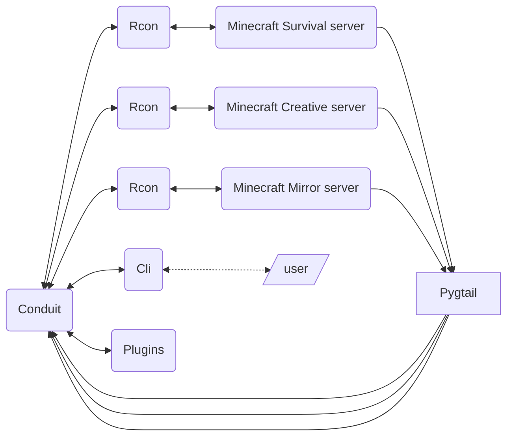
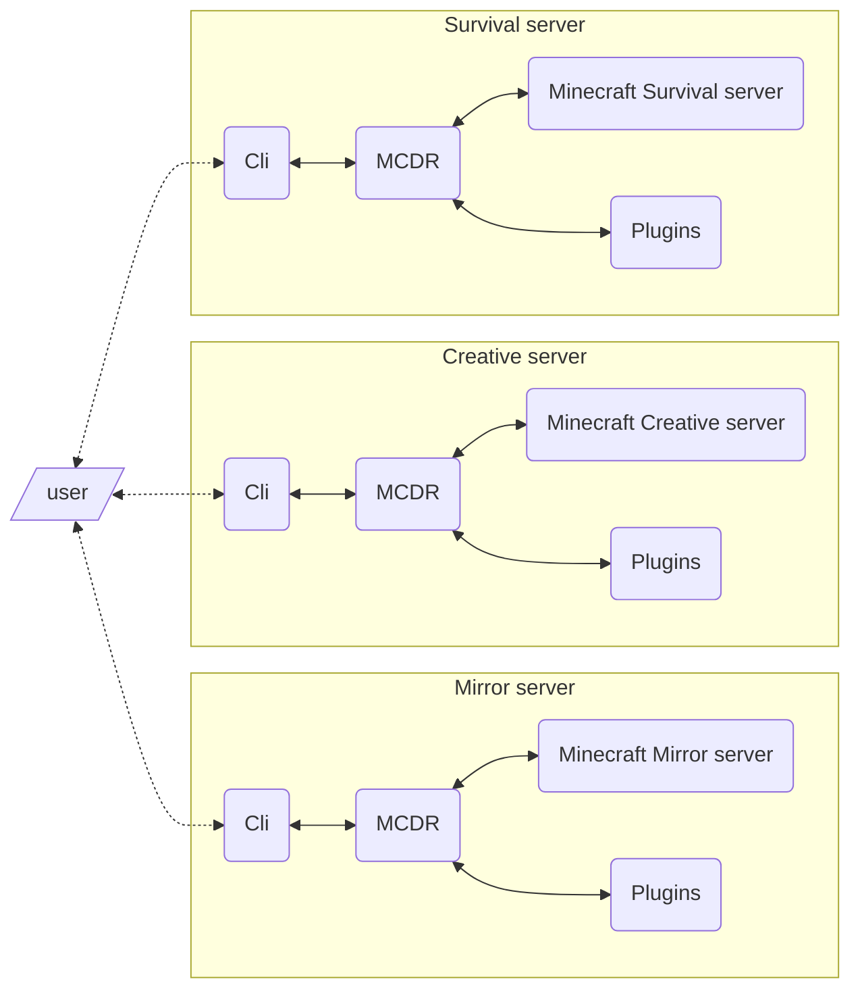

# Conduit

Conduit is a tool to control multiple Minecraft servers using Python.

It's an alternative to [MCDReforged](https://github.com/MCDReforged/MCDReforged) but easier to use/setup.

Rigth now MCDR it's probably the best option, unless you want to setup a simple command system very quickly.
If you want anyway, you can use both MCDR and Conduit without problems.

## How does it works
Conduit uses Pygtail to read server logs and extract useful informations and dispatch events.
It can also execute commands and fetch player informations via Rcon.

## Key features
Conduit is designed to be:
- Easy to install
- Run indipendently from server
- Updated without restart the server
- Easy to develop
- Safe

## Conduit vs MCDReforged
Conduit and MCDReforged do almost the same thing but there are some key differences: Conduit doesn't run the Minecraft server directly, but in a parallel process.

This is a simple scheme of how Conduit works:

This instead is a simplified scheme of how MCDR works:

### Pros (better than MCDR)
- Easier to install

- Complitely indipendent from the server

- Updates manually

- Server/Handler attributes access from CLI

- Nicer APIs

### Const (worse than MCDR)
- Still in early development

- Not too many features

- Could be tested better

- Only works on vanilla

- Not well documented

## How to install
To setup Conduit check the [wiki](https://github.com/1attila/Conduit/wiki), it's easier than you might think!

## Features
Current features:
- Rcon
- Events
- Commands (kinda)
- Json text
- Cli
- Multilingual
- Data fetch

## Future updates
- Permissions
- Commands
- Plugin system
- More events
- More data fetching
- UIs
- Even easier to setup
- Better CLI
- Add supports for bukkit/spigot/forge, etc

Keep in mind that these updates will not be released in order.

## Credits
This proejct is heavily inspired by MCDReforged, huge credits to all the [MCDR team](https://github.com/MCDReforged)!!

## Contributions
If you would like to help in any way (suggest features, report bugs, test beta features, write documentations, write some scripts) you are very welcome!
Contact me on discord: attila8829

## Documentation
For any info consult the wiki [here](https://github.com/1attila/Conduit/wiki)